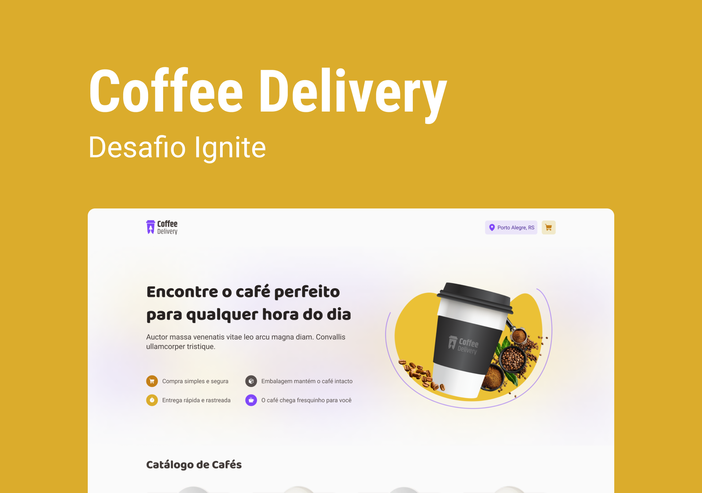

<p align="center">
    
<p/>
<h1 align="center">
    Ignite Coffee Delivery
</h1>
<div align="center" width="500px"/>

  <a href="">
    
  </a>

  <a href="">
    
  </a>

  <a href="">
    
  </a>

  <a href="">
    
  </a>
</div>
<p align="center">
  
 </p>
 <h2>📷 Preview </h2>
  <div style="display: flex; flex-direction: row;">
    <h2>Selecionando Cafés</h2>
    
     <h2>Preenchendo formulários</h2>
    
  <div>
  <h3>Funcionalidades</h3>
  Ignite Coffee Delivery é uma aplicação educativa com funcionalidade como carrinho de compra, validação de formulário com React hook form e useContext para compartilhar funcionalidade  desenvolvida 
  a biblioteca React Js.
  
  <h2 id="usage" > 👷 Requisitos </h2>

Install git, node and yarn (or npm).

```bash
# Clone Repository
$ git clone https://github.com/franciniltonsoaresmenzes/coffee-delivery.git

# Go to server folder
$ cd coffee-delivery

# Install Dependencies

$ npm install

# Run Aplication

$ npm run dev

# Access localhost
http://localhost:5173
```


  
